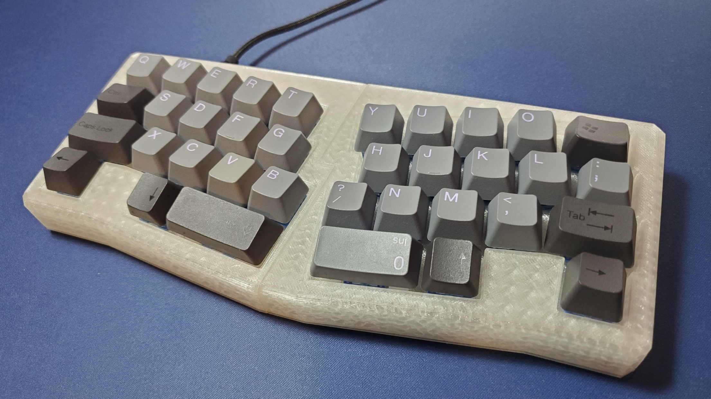
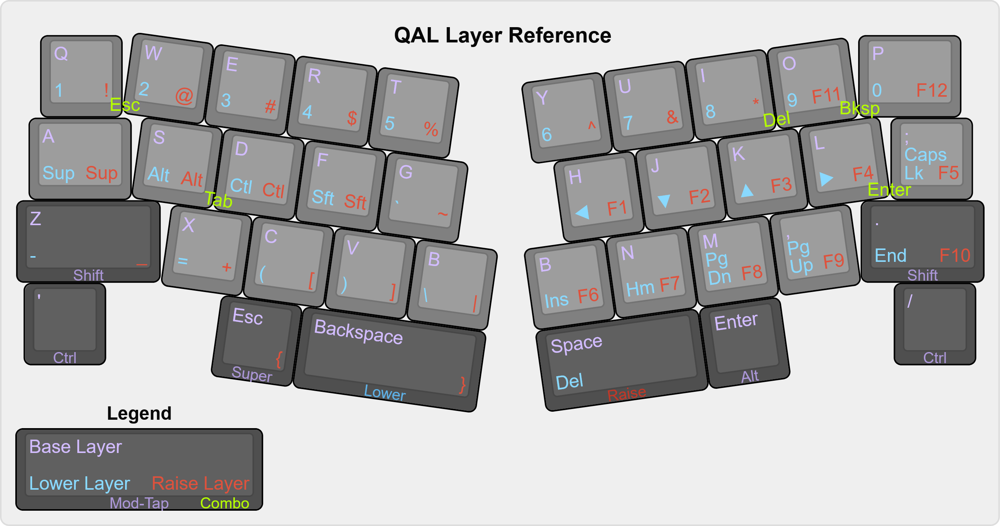
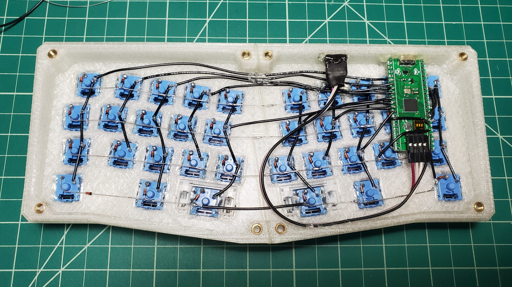

# QAL

An ergo 35% 3d printed handwired mechanical keyboard for small print beds, inspired by [QAZ](https://www.cbkbd.com/product/qaz-keyboard-kit), [Prime_E](https://www.primekb.com/collections/keyboards/products/prime_e-rev-2-pcb), and [Alice-like Handwired](https://github.com/ramonimbao/Alice-like_Handwired).

### Related Projects

[QALBLE](https://github.com/somepin/qalble) - My next iteration of this project. Has a top mounted case design and a wireless PCB via the ItsyBitsy nRF52840 daughterboard.

[Adalyn](https://github.com/MarvFPV/Adalyn/) - Aesthetic top mount design featuring a PCB with an integrated microcontroller, by MarvFPV and tominabox1.

## Project Structure

`/design` - Fusion 360 and STEP files for modification. The timeline is a bit messy since this is my first Fusion 360 project.

`/firmware` - QMK firmware files. Copy/paste `qal` into the `keyboards/handwired` directory of your QMK repository to compile. Or just flash `handwired_qal_default.bin`.

`/img` - Readme images.

`/stl` - STLs to print.

## Design Goals/Constraints

- Create 10u Alice layout with QAZ key placement
- Split model to fit on 150mm print bed
- Use STM32F401 "Black Pill" clone for USB-C and being cheaper than Pro Micros at this time
- Use hardware I already have (wire, fasteners, stabs)
- Remove [home row mods](https://precondition.github.io/home-row-mods) on base layer to see if 10u is usable without them

## Layout

Have fun copy/pasting A, Z, P, backspace, and numbers now 😈

But actually, heres how to use this thing:

[Keyboard Layout Editor](http://www.keyboard-layout-editor.com/#/gists/f555868966747690694094a6c5b4c6fd)

This keyboard uses the QMK features of layers, combos, and mod-tap to access additional keys.

### Layers

Holding down the left backspace thumb key accesses the numrow and navigation keys, while holding the right space accesses symbols and function keys. Both raise and lower layers have home row modifiers on the left hand.

### Combos

These are on the base layer. Esc, Tab, Backspace, and Enter are mostly where they would be on a traditional layout, except you have to press two keys to use them now. Esc, Backspace, and Enter are also on thumb keys if comboing them isn't your thing.

### Mod-Tap

Holding Z or . act as Shift, and holding ' or / in the bottom corners act as Ctrl, while tapping sends each key. This is so the pinky modifier positions remain the same from a traditional layout. Esc and Enter are mod-taps for Super and Alt respectively, as well.

## Components

Amazon links to the parts I used are included for convenience, but feel free to go with whichever vendor you like.

| Part                    | Quantity | Notes                                                                            | Link                                         |
| ----------------------- | -------- | -------------------------------------------------------------------------------- | -------------------------------------------- |
| Keycaps                 |          | The layout supports most base kits, other than the row profiles being inaccurate |                                              |
| Switches                | 36       | MX or clones of your choice                                                      |                                              |
| Plate-mount Stabilizers | 2        | 2u Cherry style                                                                  | https://www.amazon.com/gp/product/B096JQD679 |
| Diodes                  | 36       | Through hole 1N4148                                                              | https://www.amazon.com/gp/product/B00N1ZKU7E |
| Hookup Wire             |          | I used stranded 24 gauge wire, but anything works                                | https://www.amazon.com/gp/product/B00NB3SYB0 |
| Screws                  | 8        | M4 x 8mm button head                                                             | https://www.amazon.com/gp/product/B08M6FN88Z |
| Heat Set Inserts        | 8        | M4 x 4mm (L) x 5mm (OD)                                                          | https://www.amazon.com/gp/product/B07LBQV2HK |
| Rubber Bumpons          | 8        | 8mm x 2.5mm                                                                      | https://www.amazon.com/gp/product/B08JH4RW1G |
| STM32F401CCU6 Dev Board | 1        | A Pro Micro can be used instead, but it would require a rewrite of the firmware  | https://www.amazon.com/gp/product/B07XBWGF9M |
| ST-Link V2 Clone        | 1        | Optional, makes flashing firmware slightly less inconvenient                     | https://www.amazon.com/gp/product/B01EE4WAC8 |
| Jumper Wire             |          | Optional, only needed if using ST-Link to flash firmware                         | https://www.amazon.com/gp/product/B07GD2BWPY |

### Tools

- 3d printer & your favorite color of filament
- Soldering iron & solder
- Hot glue gun & hot glue
- Multimeter
- Wire cutter/stripper
- 4mm hex screwdriver
- Super glue

### Printed Case

- Top left integrated plate
- Top right integrated plate
- Bottom left plate
- Bottom right plate

I guess the bottom plate is optional if you don't mind the wires and microcontroller hanging out above your desk.

## Printing

Each quarter of the case fits on a 150mm print bed. To print the top and bottom plate as one piece each, you'd need at least a 250mm print bed.

Print at a 0.2mm layer height. Rotate each piece upside down (180 degrees) in your slicer, and enable supports for the top halves. I've had success using Cura tree supports.

## Wiring

I used short pieces of stripped wire for the columns and diode legs for the rows.

## Assembly

After printing, super glue each side of the integrated top plate and bottom plate together. For the heat set inserts, I like to keep my soldering iron at 250°C. I ring the insert around the soldering iron tip, holding the insert with tweezers to guide it. Then, I remove the iron after the insert is 80% in and quickly flip the case over, pushing the insert the rest of the way in. Clip in the switches to the plate, then hot glue them for added stability.

Solder the switch matrix following the [QMK Hand Wiring Guide](https://docs.qmk.fm/#/hand_wire). If using a ST-Link, solder the 90 degree male headers to the side of the microcontroller with the electronics. Slot in the microcontroller to the USB cutout, and solder the wires to the matrix. Attach female-female jumper cable from the male headers to the case cutout. Hot glue the microcontroller and jumper cable headers for extra support.

Screw in the bottom plate, install keycaps, and you have yourself a QAL!

## Firmware

Since QMK Toolbox doesn't support flashing STM32 chips yet, I used [STM32CubeProgrammer](https://www.st.com/en/development-tools/stm32cubeprog.html) to flash the firmware on to the keyboard.

After compiling a .bin with `make handwired/qal:default` in QMK, the steps for flashing in STM32CubeProgrammer are similar whether or not you have a ST-Link.

To flash the .bin over USB **without a ST-Link**, flip the dip switch on the microcontroller closest to the reset button to enter DFU mode, and plug in the keyboard. In STM32CubeProgrammer, go to Erasing & Programming, select USB in the right-hand dropdown, and click the green Connect button. Browse for the .bin, then click Start Programming. Once the keyboard is done flashing, unplug it and flip the dip switch back. Plug it back in and you should have a fully functioning keyboard.

**Using a ST-Link**, run male-female jumper cables from the keyboard to the ST-Link dongle. Ensure that the pins for SWCLK, SWDIO, GND, and 3.3V match. With the keyboard unplugged from USB-C, plug in the ST-Link with the jumper wires attached. In STM32CubeProgrammer, go to Erasing & Programming, select ST-LINK in the right-hand dropdown, and click the green Connect button. Browse for the .bin, click Start Programming, and it should flash almost instantaneously. Disconnect in the software then unplug the ST-Link from the USB port and keyboard. The keyboard should then work after plugging it in with a USB-C cable.

## Issues

- ~~No VIA support for STM32 without adding an external EEPROM chip~~ Not as much of an issue with QMK PR [#14195](https://github.com/qmk/qmk_firmware/pull/14195)

- Use caution while changing keycaps, as some switches might come out even if hot glued to the plate